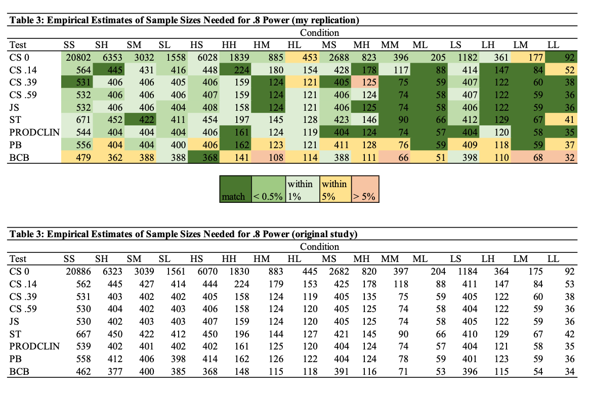

```{r setup, include = FALSE}
# packages
library(dplyr)
library(knitr)
library(xtable)

# settings
knitr::opts_chunk$set(echo = FALSE, message = FALSE, warning = FALSE)
```
\urlstyle{same} <!--ensure urls have the same style as the rest of the text-->

\maketitle Replication Report - Fritz & MacKinnon (2007)

\subsection*{Abstract}
This repliSIMS project is a replication of the Fritz \& MacKinnon (2007) paper titled "Required Sample Size to Detect the Mediated Effect" published in \emph{Psychological Science}. The primary outcome of interest is a table of required sample sizes needed for a mediation study to achieve 80\% power. In mediation analysis, the mediated effect is the product of two parameter coefficients, and this article gives sample size recommendations for 16 different parameter estimate effect size combinations. The article also compares results from six different commonly used tests of statistical significance for the mediated effect. The article contained enough information to produce a replication in R with only two replicator degrees of freedom, which did not seem to impact the results. Results were mostly replicated, with nearly half of the sample sizes calculated to achieve 80\% power being exactly the same. Most other sample sizes were close (numbers being within 5\% different), but a few larger differences were observed and are discussed.
\vskip 2em

\noindent\makebox[\textwidth]{\large Correspondence concerning this replication report should be addressed to: Jessica Fossum}\par
\noindent\makebox[\textwidth]{\large jfossum@ucla.edu}\par

\clearpage

\section{Introduction}

This replication report documents the replication attempt of the simulation study @Fritz07. 
Following the definition of @rougier_sustainable_2017-1 we understand the replication of a published study as writing and running new code based on the description provided in the original publication with the aim of obtaining the same results.

\section{Method}

\subsection{Information basis}
The purpose of this article is to compare the sample sizes required to achieve 80\% power from six different tests of the mediated effect at various effect size combinations. 

The information used in this replication was gathered entirely from the published article. There are two references made in the article to programs used, however, neither of those references were used for this replication because both link to MacKinnon's Research in Prevention Laboratory page at ASU and I was unable to find the pages that are supposed to be accessed via the links. 

The first link given is to download a program that performs one of the six methods, the PRODCLIN method (http://www.public.asu.edu/~davidpm/ripl/Prodclin/). As PRODCLIN was originally written for FORTRAN, instead of trying to track down this link I instead used the RMediate package in R (Tofighi & MacKinnon, 2016) because it is based on the PRODCLIN program and is open source.

The second link seems like it should go to a website that runs the tests used in the article so researchers can estimate required sample sizes for other parameter combinations and power levels that this article did not calculate. This link would have been helpful as an additional way to check my replication code, but I just replicated the results presented in the paper using the parameter estimates and power level they chose, so missing this link was not detrimental for the purpose of this replication.

\newpage

\subsection{Data Generating Mechanism}
Information provided in the above mentioned sources indicated that the following simulation factors were systematically varied in generating the artificial data.

| Simulation factor | No. levels | Levels|
|------|--|-------|
| *Varied*||   
| Parameter estimate: $a$-path path | 4 | .14, .26, .39, .59 |
| Parameter estimate: $b$-path path | 4 | .14, .26, .39, .59 |
| Parameter estimate: $c'$-path path | 4 | 0, .14, .39, .59 |
| Inferential Method $c'$-path path | 5 | Causal Steps Approach, Joint Significance Test, Sobel Test, PRODCLIN, Percentile Bootstrap Confidence Interval, Bias-corrected Bootstrap Confidence Interval |
| *Fixed* |||
| Power|| 80\% (with varied margins of error)|
| Alpha|| .05 |

\subsubsection{Parameter estimate: $a$-path}
In a simple mediation model (one predictor X variable, one mediator M variable, and one outcome Y variable), the $a$-path is the regression coefficient predicting M from X. The size of this parameter is determined by the effect size of the relationship between X and M. Four effect sizes were chosen based on Cohen's 1988 guidelines of standard effect sizes in psychology. The three commonly used effect sizes in psychology for Multiple $R^2$, according to Cohen, are $f^2=0.02$ for small, $f^2=0.15$ for medium, and $f^2=0.35$ for large. To get the corresponding standardized regression path coefficients to use in our mediation model, we take the square root of each of these values. That results in our path coefficient effect sizes being $\sqrt{0.02}=0.14$ for small, $\sqrt{0.15}=0.39$ for medium, and $\sqrt{0.35}=0.59$ for large. Additionally, the article includes 0.26 as the fourth path coefficient estimate because of how common this small to medium effect is seen in psychological research.

\subsubsection{Parameter estimate: $b$-path}
In a simple mediation model, the $b$-path is the regression coefficient predicting Y from M controlling for X. Using the same parameter estimates for the $b$-path as for the $a$-path, we use $b = .14$ for small, $b = .26$ for small to medium, $b = .39$ for medium, and $b = .59$ for large.

\subsubsection{Parameter estimate: $c'$-path}
In a simple mediation model, the $c'$-path is the regression coefficient predicting Y from X controlling for M. Using the same parameter estimates plus additionally testing 0, we use $c' = 0$ for no direct effect, $c' = .14$ for small, $c' = .39$ for medium, and $c' = .59$ for large.

Previous literature on the mediated effect, which is calculated by multiplying the $a$-path by the $b$-path, show that for power analysis the effect size on the $a$-path and the effect size on the $b$-path matter separately. For example, a model where $a = .14$ and $b = .59$ will not give the same level of power as a model where $a = .59$ and $b = .14$, even though both models are looking to detect the same mediated effect of .0826. For this reason, both the $a$-path and $b$-path are separate parameters in this simulation, and all 16 permutations of the four parameter estimates are tested. Additionally, although the size of the $c'$ path coefficient for the direct effect should only affect the Causal Steps Approach results, all four effect sizes on the $c'$-path are tested as well.

The design was full factorial, so each of the 64 permutations of effect size parameters was tested using each of the six methods for testing the indirect effect.


\begin{minipage}{\linewidth}
Data generation can be summarized with the following pseudo code:

\texttt{For each of the 4 effect size parameter combinations for the $a$-path:}

\texttt{For each of the 4 effect size parameter combinations for the $b$-path:}

\texttt{For each of the 4 effect size parameter combinations for the $c'$-path:}

\texttt{Repeat the following procedure for each: the causal steps approach, joint significance test, Sobel test, and PRODCLIN:}
\begin{itemize}[leftmargin=*] 
	\item[--] \texttt{Generate 100000 samples of data for three variables (X, M, and Y) based on the effect size parameter estimates for sample size N (initially 200, then iteraatively adjusted)}
	\item[--] \texttt{Run OLS regressions and calculate the indirect effect estimate for each sample}
	\item[--] \texttt{Test the statistical significance of the indirect effect estimate}
	\begin{itemize}
	  \item[$\ast$] \texttt{Record proportion of significant (p < .05) indirect effects}
	  \item[$\ast$] \texttt{Calculate observed power by dividing proportion of significant indirect effects by 100000 samples tested}
	  \item[$\ast$] \texttt{If power is within .1\% of 80\%, record sample size N}
	  \item[$\ast$] \texttt{Else, rerun with a new estimate for N}
	\end{itemize}
\end{itemize}
	
\texttt{For the percentile bootstrap confidence interval and bias-correced bootstrap confidence interval:}
\begin{itemize}[leftmargin=*]
	\item[--] \texttt{Generate 1000 samples of data for three variables (X, M, and Y) based on the effect size parameter estimates for sample size N}
	\item[--] \texttt{Bootstrap each sample using 2000 bootstraps}
	\item[--] \texttt{Run OLS regressions and calculate the indirect effect estimate for each sample}
	\item[--] \texttt{Test the statistical significance of the indirect effect estimate using the Percentile Bootstrap Confidence Interval / Bias-corrected Bootstrap Confidence interval with 2000 bootstraps}
	\begin{itemize}
	  \item[$\ast$] \texttt{Record proportion of significant (confidence interval does not include 0) indirect effects}
	  \item[$\ast$] \texttt{Calculate observed power by dividing proportion of significant indirect effects by 1000 samples tested}
	  \item[$\ast$] \texttt{If power is within .5\% of 80\%, record sample size N}
	  \item[$\ast$] \texttt{Else, rerun with a new estimate for N iteratively adjusted based on the slope between previous sample size and power estimate and current estimates to try and get closer to 80\% power}
	\end{itemize}
\end{itemize}
\texttt{Compile a table of required sample sizes where columns represent parameter estimate effect size combinations and rows represent the six tests of the indirect effect}
\end{minipage}
\newpage
\FloatBarrier <!-- ensure there are no plots in the references -->

\subsection{Compare Methods}
Six different methods of testing the mediated (indirect) effect were used. All six were programmed in R as functions and implemented in the simulation study to perform each method of testing the statistical significance of the indirect effect.

The six methods were as follows:

1. Causal Steps Approach [@Baron86]
2. Joint Significance Test [@kenny98]
3. Sobel Test [@sobel82]
4. PRODCLIN [@MacKinnonFritz07]
5. Percentile Bootstrap Confidence Interval [@efron93]
6. Bias-corrected Bootstrap Confidence Interval [@efron93]


\subsection{Technical implementation}
While the original simulation study was carried out for all single-sample simulations using SAS Version 8.2 (SAS Institute, 2004), and all resampling simulations were conducted using R Version 2.2.0 (R Development Core Team, 2006). Our replication was implemented
using the R programming environment (details regarding software versions can be obtained from the section Reproducibility Information). 
The corresponding R code can be obtained from https://github.com/replisims/jfossum. 
<!-- Add zenodo doi once obtained-->

The following are an overview of replicator degrees of freedom, 
i.e. decisions that had to be made by the replicators because of insufficient or contradicting information. 
Issues were resolved by discussion among the replicators. 
Decisions were based on what the replicators perceived to be the most likely implementation with likeliness estimated by common practice and/or guideline recommendations.

Issue 1:  The criteria for the margin of error on power level for bootstrap simulation methods was not explicitly stated in the article (expanded on in section 2.5).

Issue 2: One of the tests of the indirect effect, PRODCLIN, was originally written in the programming language FORTRAN. It was unreadable in any open source programming language and a version of the program written for R sometimes halts execution for an unknown error (expanded on in section 2.6).

\subsection{Issue 1: Criteria for the margin of error on power level for simulation methods}
The article gives explicit criteria for the margin of error on power level to be set at .1\%. However, this was for the non-resampling method tests (Causal Steps Approach, joint significance test, Sobel test, PRODCLIN) where 100000 samples are tested. For the simulation approaches (both bootstrapping methods), only 1000 samples were tested, so sticking with the margin of error of .1\% would have meant that exactly 800 of the 1000 samples were statistically significant. The replicators decided this was too specific of a criteria, so we increased this margin of error to .5\% to make results attainable. The decision to use .5\% was arbitrarily chosen to be as small as possible while still reasonably close to .1\%. Additionally, for the largest effect size combination (both paths set to .59), the sample sizes were too small so the difference between two consecutive integers (sample size of 36 vs. 37) produced such a large difference in power that it was impossible to get either sample size to have power close enough to 80\%. In this condition, the margin of error was set to 1\% for all tests. I'm not sure how the original article got power to be within .1\% of 80\% with such small sample sizes.

\subsection{Issue 2: PRODCLIN method is for FORTRAN}
The PRODCLIN method was originally developed and implemented in the FORTRAN language. Since none of the replicators have much FORTRAN experience, and we wanted our replications to be entirely in R because it is an open source programming language, we used the RMediate package. This package is based on an original FORTRAN program, but we ran into a bug in the program that sometimes gave an error that no valid upper bound was found. We traced this error back to the integration function that Rmediate relies on, called in the medci() function we used to get a confidence interval from the mediation.  These errors were tallied and any run that resulted in that error was thrown out of final analyses (445 such errors were recorded out of the 1600445; about .03\%). Those cases were rerun, so the total number of samples for each test remained consistent (1000 for simulation methods and 100000 for nonsimulation methods).

\section{Results}

The main result of interest in this paper was Table 3. This table gives sample sizes required to achieve 80\% power. It includes 16 rows of parameter estimate effect size combinations, and 6 columns representing tests of the mediated effect.

\subsection{Replication of result tables}

The tables below show the results from my simulation (top) and the original table from the article (bottom). Both tables are sample sizes needed to achieve 80\% power using the test in the row and the effect size combination in the column. 

My table is color coded to show how close each sample size is from my simulation to the original sample size reported in the article I am replicating. Colors are chosen arbitrarily for intervals that represent how close the sample sizes are. I chose to divide the sample size from my replication results by the sample size from the original study to get a somewhat standardized idea of how close the two sample sizes are. If the two samples are exactly the same, the percentage would be a 100\% match. Dark green represents this exact match. Medium green represents the two sample sizes are within 0.5\% of each other when the sample size from my simulation was divided by the original sample size, so for example the result for SS with test CS 0 is 20886 and my replication found 20802, and 20802/20886=0.996 or 99.6\% match which is less than 0.5\% different. This division was done to put sample sizes on a consistent metric, since the difference between a sample size of 20 and 21 represents a much larger difference in power than the difference between a sample size of 200 and 201, even though both are a sample size increase of one. Light green represents a percentage difference within 1\%. Yellow is within 5\%, and red is greater than 5\% different. 

```{r figurename, echo=FALSE, out.width = '95%'}

```


\FloatBarrier
\section{Discussion}

\subsection{Replicability}
After a few replicator degree of freedom decisions were made, this simulation study was replicable. My results align with those from the original simulation, giving sample sizes within 5\% of each other  required to achieve 80\% power (with a few exceptions, notably one that was very different). None of the tests seemed to systematically overestimate or underestimate the required sample size, though I noticed that the bias-corrected bootstrap confidence interval and the percentile bootstrap confidence interval were the tests that had the most disagreement. This was likely because I increased the acceptable margin of error on power from .1\% in the article to .5\%, so my sample sizes are not as precise as the original sample sizes.

Replicating this simulation was an eye-opening experience. I selected an article that did an excellent job reporting their methods for the simulation, so I had an easier time than most probably did with replicating the simulation. However, even with the clear and detailed descriptions, there were still some things that were difficult to decipher. This paper is closely related to my current research project, so I had previously replicated portions of this simulation study in the GAUSS programming language, using the same tests except excluding PRODCLIN. If it is of interest, I was able to get similar results in that replication as well, though I did not fully finish this study and do not have full conclusions. For example, using the Causal Steps approach with all three effect sizes set to .39, 75 is still the sample size chosen for 80\% power. When my R replication and the original study disagreed, such as using the Causal Steps approach with the $a$-path = .26, the b-path = .50, and the $c'$-path = 0, my replication sample size of 453 has 80.135\% power (which would fall above the .1\% margin of error) and the original article sample size of 445 has 79.262\% power (which would fall below the .1\% margin of error). I think that speaks to the fact that simulation studies are not an exacting science, especially for power analysis. But the fact that it is close in multiple different programming languages and very similar results are found is to the credit of simulation replications. Even with that prior GAUSS experience, I ran into challenges with the way certain R functions work and it took time to make sure my code matched what the authors described in their simulation. Having a co-pilot very familiar with the literature in this area and the decisions other researchers tend to make was very helpful.

The replication process has been very helpful for me as I'm writing my own methods section for my own simulation study. There are many things I hadn't thought to include, such as the number of bootstraps I used for forming bootstrap confidence intervals, until I was replicating this simulation study and needing to reference the original article for the information.

\subsection{Replicator degrees of freedom}
The main replicator degree of freedom was choosing an appropriate margin of error for the simulation methods. The authors could have specifically stated this criterion, or said that their criteria of .1\% was used for all methods instead of only including that value in the non-simulation methods section of the article. When I tried this criteria for the resampling methods, I ran into problems where no sample size was found that had power within that narrow margin of error (i.e., a sample size of 34 could have 79.9\% power and 35 could have 80.1\% power, and neither are witin the margin of error).  My decision of using .5\% for the simulation methods could have influenced the results by making my results of required sample sizes not as accurate as the authors of the original simulation. However, I believe my criteria of .5\% was close enough that it did not drastically impact the results.

The other replicator degree of freedom came from the PRODCLIN program being designed for FORTRAN. Thankfully, this was an easy fix with the RMediation package in R, written by the same authors as the PRODCLIN package. There is a bug in the package, and the authors are aware of the bug. Anytime that issue was found the result was not included in my simulation results, however the samples thrown out were systematically the ones where the $a$-path was larger than the $b$-path.


\subsection{Equivalence of results}
For the most part, my results are overall equivalent to the original article. Since these are sample sizes, I judged equivalence by how similar the sample sizes are proportional to each other (since the difference in power between a sample size of 20 and 21 is a much bigger difference than the difference in power between 200 and 201 would be, I wanted the sample size comparison to reflect that). 45 of the 144 sample sizes matched exactly. 32 were within 0.5\%, 40 were within 1\%, 22 were within 5\%, and 5 were more than 5\% away. Most of the larger discrepancies happened in the bootstrapped tests, which does  not concern me because I made a choice to have a larger margin of error for those tests. The only possible result that concerns me is in the Causal Steps test where $c'$-path is set to a medium effect size (.39), the $a$-path is also a medium effect size (.39), and the $b$-path is a large effect size (.59). My simulation results say we need a sample size of 135 for 80\% power, but the original article says a sample of 125 participants is sufficient. My sample size is only 8\% higher, so it is not too concerning, but a difference of 10 participants in a study that is only recruiting 125 participants may actually impact power for the test so I would be a bit wary if researchers cite this original article as justification for recruiting 125 participants to power their analysis at 80\%. 

Overall, even with the replicator degrees of freedom, my replication results align well with the results given in the original article.

\section{Contributions}
Authors made the following contributions according to the CRediT framework https://casrai.org/credit/

Primary Replicator: Jessica Fossum

- Data Curation  
- Formal Analysis (lead)  
- Investigation  
- Software  
- Visualization (lead)  
- Writing - Original Draft Preparation  
- Writing - Review & Editing  

Co-Pilot: Amanda Montoya

- Formal Analysis (supporting)  
- Investigation  
- Software (supporting)  
- Visualization (supporting)  
- Validation  
- Writing - Review & Editing  


\newpage

\section*{References}
\noindent
\begingroup
\hphantom{x}
\setlength{\parindent}{-0.5in}
\setlength{\leftskip}{0.5in}
<div id="refs" custom-style="Bibliography"></div>
\FloatBarrier
\endgroup
\newpage

\section*{Appendix}

\subsubsection*{Reproducibility Information}

This report was last updated on `r Sys.time()`. 
The simulation replication was conducted using the following computational environment and dependencies: 

\FloatBarrier
```{r colophon, cache = FALSE}
# which R packages and versions?
if ("devtools" %in% installed.packages()) devtools::session_info()
```

The current Git commit details are: https://github.com/replisims/fritz-2007

```{r git}
# what commit is this file at? 
if ("git2r" %in% installed.packages() & git2r::in_repository(path = ".")) git2r::repository(here::here(replisims/fritz-2007))  
```
